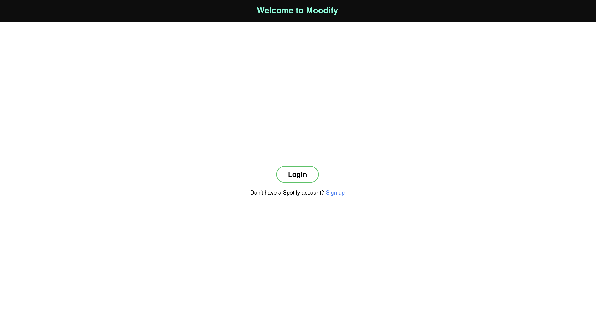
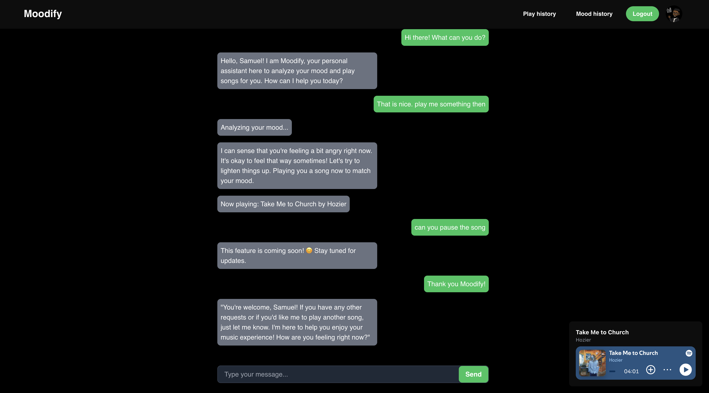

# Moodify: Your Mood-Based Music Assistant 🎶

**Moodify** is an intelligent chatbot that seamlessly integrates emotional analysis and music recommendations. By analyzing the user’s mood using a pre-trained machine learning model, Moodify curates songs from Spotify’s rich library to perfectly align with how the user feels. Whether you're happy, calm, or reflective, Moodify ensures that your emotions resonate with the right music.

## Who is it for?

Moodify is perfect for:
- **Music Enthusiasts** who want music tailored to their emotional state.
- **Mental Wellness Seekers** looking for a way to connect with their feelings through music.
- **Curious Users** eager to explore the intersection of technology, AI, and music personalization.

## The Problem It Solves

Choosing the right music can sometimes feel overwhelming, especially when your mood shifts. Moodify eliminates this friction by leveraging emotional analysis and Spotify embeddings, providing a hands-free, emotion-driven music discovery experience.


## Table of Contents
- [Features](#features)
- [Getting Started](#getting-started)
- [How It Works](#how-it-works)
- [Technologies Used](#technologies-used)
- [Future Enhancements](#future-enhancements)
- [Contributing](#contributing)
- [Contact](#contact)


## Features

Moodify offers a range of functionalities designed to enhance your music listening experience by connecting it with your emotions:

- **Mood Analysis**: Uses the **DeepFace** pre-trained machine learning model to analyze your emotions in real-time through images or chat input.
- **Music Recommendations**: Recommends and plays songs tailored to your current mood, leveraging Spotify's song embeddings.
- **Chatbot Integration**: Engage in natural conversations with Moodify, making the experience interactive and user-friendly.
- **Playback Control**: Supports the following playback actions:
  - Play Next Song
- **Intuitive User Interface**: A clean and responsive interface that includes:
  - A login page for seamless Spotify authentication.
  - A dashboard displaying the current song and chat interactions.
- **Persistent State**: Retains the chat history and the current song, even after a page refresh.

> Note: Moodify currently does not support Play and Pause functionality.


## Getting Started

Follow these instructions to set up and run Moodify on your local machine.

### Prerequisites

Ensure you have the following installed on your system:

- **Node.js** (v16 or higher)
- **Python** (3.8 or higher)
- **Spotify Developer Account** for creating a client ID and secret
- **MongoDB** (local or cloud instance)
- **npm** (comes with Node.js)

### Installation

1. Clone the repository:
    ```bash
    git clone https://github.com/your-username/Moodify.git
    cd Moodify
    ```

2. Set up the backend:
    - Navigate to the `backend` directory:
        ```bash
        cd backend
        ```
    - Create a virtual environment and activate it:
        ```bash
        python -m venv venv
        source venv/bin/activate # On Windows: venv\Scripts\activate
        ```
    - Install the required dependencies:
        ```bash
        pip install -r requirements.txt
        ```
    - Create a `.env` file and configure the following constants:
        ```plaintext
        MONGODB_USERNAME=<your-mongodb-username>
        MONGODB_PASSWORD=<your-mongodb-password>
        MONGODB_DB_NAME=<your-database-name>
        APP_SECRET=<your-app-secret>
        SPOTIFY_CLIENT_ID=<your-spotify-client-id>
        SPOTIFY_CLIENT_SECRET=<your-spotify-client-secret>
        OPENAI_API_KEY=<your-openai-api-key>
        TOKEN_SECRET=<your-jwt-token-secret>
        ```

3. Set up the frontend:
    - Navigate to the `frontend` directory:
        ```bash
        cd ../frontend
        ```
    - Install dependencies:
        ```bash
        npm install
        ```
    - Create a `.env` file in the `frontend` directory and configure the following constants:
        ```plaintext
        OPENAI_API_KEY=<your-openai-api-key>
        SERVER_URL=http://localhost:4000
        ```

### Running the Application

1. Start the backend server:
    ```bash
    cd backend
    source venv/bin/activate # Activate the virtual environment if not already active
    bash start.sh
    ```

2. Start the frontend:
    ```bash
    cd frontend
    npm start
    ```

3. Access the application:
    - Open your browser and navigate to `http://localhost:3000`.

---

### Troubleshooting

If you encounter issues, here are some common solutions:

1. **Backend not starting:**
    - Ensure the `.env` file in the `backend` directory is correctly configured with all the required constants.
    - Check that your MongoDB instance is running and accessible.

2. **Frontend not starting:**
    - Ensure the `.env` file in the `frontend` directory is correctly configured.

3. **Spotify API errors:**
    - Double-check your `SPOTIFY_CLIENT_ID` and `SPOTIFY_CLIENT_SECRET` in the backend `.env` file.
    - Ensure the redirect URI in your Spotify Developer Dashboard matches `http://localhost:4000/callback`.

4. **Environment-specific issues:**
    - On Windows, if `source venv/bin/activate` doesn't work, use `venv\Scripts\activate`.
    - For missing Python packages, run `pip install -r requirements.txt` again.

5. **Unexpected crashes:**
    - Run `npm install` again in both the backend and frontend directories to ensure all dependencies are installed.
    - Clear the `node_modules` directory and reinstall dependencies:
        ```bash
        rm -rf node_modules
        npm install
        ```

If the issue persists, feel free to raise an issue on the [GitHub repository](#) or contact me via the details in the [Contact](#Contact) section.

## How It Works

Moodify is designed to analyze your mood and play songs that resonate with your emotions. Here's how it works:

### 1. Login with Spotify  
- The app requires you to log in using your Spotify account.  
- This allows Moodify to fetch songs and create a personalized experience.  



### 2. Chat with Moodify  
- Once logged in, you can start chatting with the Moodify chatbot.  
- Moodify can analyze your mood using a pre-trained machine learning model (DeepFace).  
- Based on the mood detected, Moodify recommends or plays a song via Spotify.  
- If you request specific actions like "Play next" or "Play previous," Moodify will handle them.  
- Features like "Pause" and "Resume" are currently under development.  



### 3. Dynamic Responses  
- Moodify dynamically adjusts its responses to match your interactions, making it a friendly assistant for your music needs.

### Key Functionalities:
- **Mood Analysis**: The chatbot detects your emotions and suggests music accordingly.
- **Spotify Integration**: Songs are fetched and played directly from Spotify.
- **Interactive Chat**: Engage in a conversation with Moodify to make requests or get recommendations.

## Technologies Used

Moodify leverages modern technologies across both the frontend and backend to deliver a seamless user experience. Here's a breakdown:

### Frontend
- **React.js**: A JavaScript library for building user interfaces.
- **Axios**: To handle HTTP requests between the frontend and backend.
- **Tailwind CSS**: For responsive and efficient styling.
- **Rive**: For creating visually engaging animations (future plans).

### Backend
- **Node.js**: A JavaScript runtime environment for the server-side application.
- **Express.js**: A web framework for building RESTful APIs.
- **MongoDB**: A NoSQL database for storing user states and chat logs.
- **Mongoose**: For object data modeling with MongoDB.
- **Spotify Web API**: For retrieving song recommendations based on mood.
- **OpenAI API**: To generate chatbot responses and interactions.
- **DeepFace**: For analyzing user emotions through images.
- **dotenv**: For managing environment variables securely.

### DevOps & Miscellaneous
- **Git**: For version control and collaboration.
- **GitHub**: To host the project repository and facilitate open-source contributions.
- **Postman**: For API testing during development.
- **Heroku**: (Planned) For deploying the application to a live environment.

## Future Enhancements

Moodify is a dynamic project with several planned upgrades and improvements to enhance user experience and functionality. Below are some of the features and enhancements we plan to implement:

### Deployment
- 🚀 **Live Deployment**: Deploy Moodify on a cloud platform such as **Heroku**, **Netlify**, or **Vercel** for easy access and demonstration.
- 📱 **Cross-Device Compatibility**: Ensure Moodify performs optimally on both desktop and mobile platforms.

### Feature Upgrades
- ⏸️ **Pause and Resume**: Introduce functionality to allow users to pause and resume their songs directly through the chatbot.
- ⏮️ **Skip to Previous Track**: Extend the chatbot's capabilities to let users skip to the previous song in the playlist.
- 🎵 **Playlist Management**: Enable users to create, manage, and save custom playlists based on their mood and preferences.
- 📊 **Mood History and Analytics**: Allow users to view a history of their mood analysis results and explore trends over time.
- 🌍 **Multiple Language Support**: Implement multilingual support for broader accessibility and inclusivity.

### User Interface Improvements
- ✨ **Advanced Animations**: Integrate more animations with **Rive** to make interactions smoother and visually engaging.
- 🌗 **Dark/Light Mode**: Introduce a toggle for dark and light mode to improve user accessibility and customization.

### Backend and AI Enhancements
- 🤖 **Improved Mood Analysis**: Refine the accuracy of mood analysis using a more advanced or fine-tuned emotion detection model.
- 🎶 **Enhanced Recommendations**: Improve song recommendations by integrating Spotify's machine learning capabilities to better match user emotions.

### Additional Suggestions
- 🔗 **Social Sharing**: Allow users to share their mood and song recommendations on social media platforms directly from Moodify.
- 🏆 **Gamification**: Introduce a points or reward system to encourage users to engage with the platform.
- 😊 **Custom Emojis or Avatars**: Enable users to personalize their Moodify chatbot interactions with custom emojis or avatars.

Moodify is a growing project, and these enhancements are designed to make the platform even more engaging, user-friendly, and impactful. Contributions and feedback are welcome!

## Contact

If you have any questions, suggestions, or feedback about Moodify, feel free to reach out:

- Email: samueltawiah2003@gmail.com
- LinkedIn: [Your LinkedIn Profile](https://www.linkedin.com/in/samuel-tawiah/)
- GitHub: [Your GitHub Profile](https://github.com/Tomtom-debug)

Feel free to open an issue or submit a pull request for improvements. We'd love to hear from you!